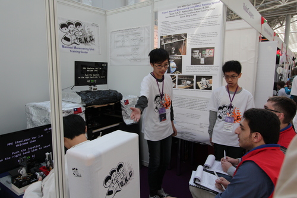
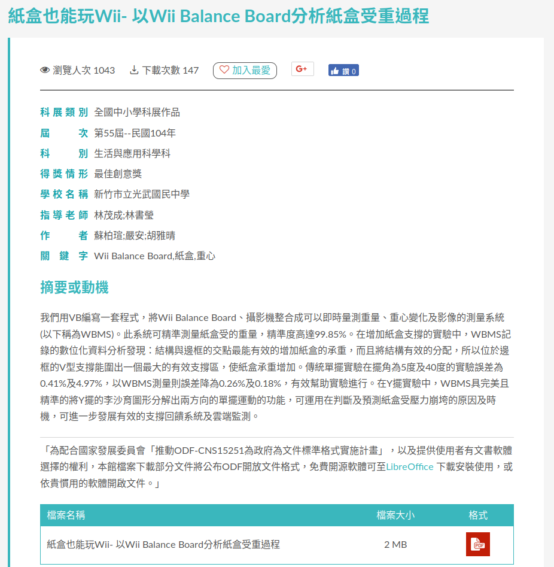
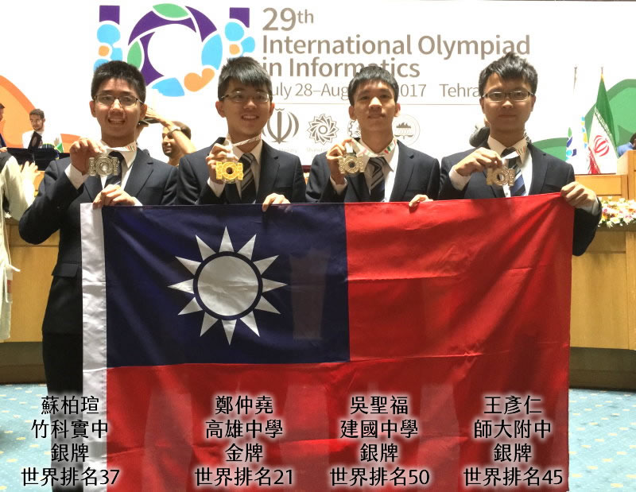
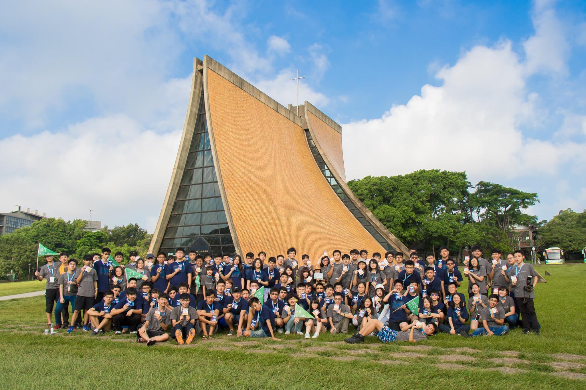
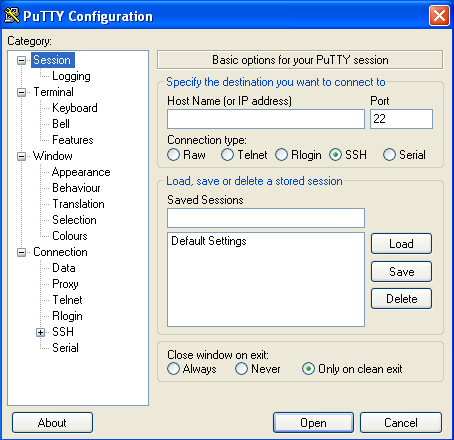
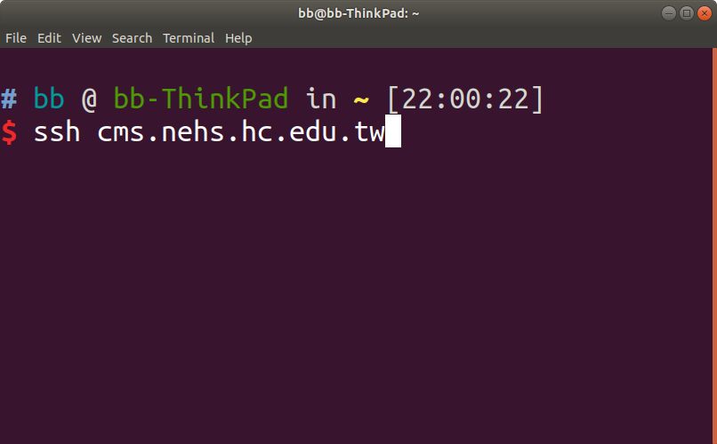
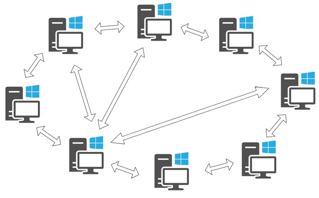
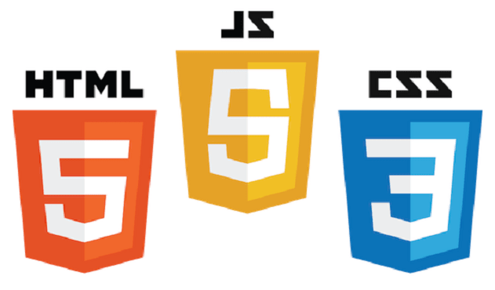
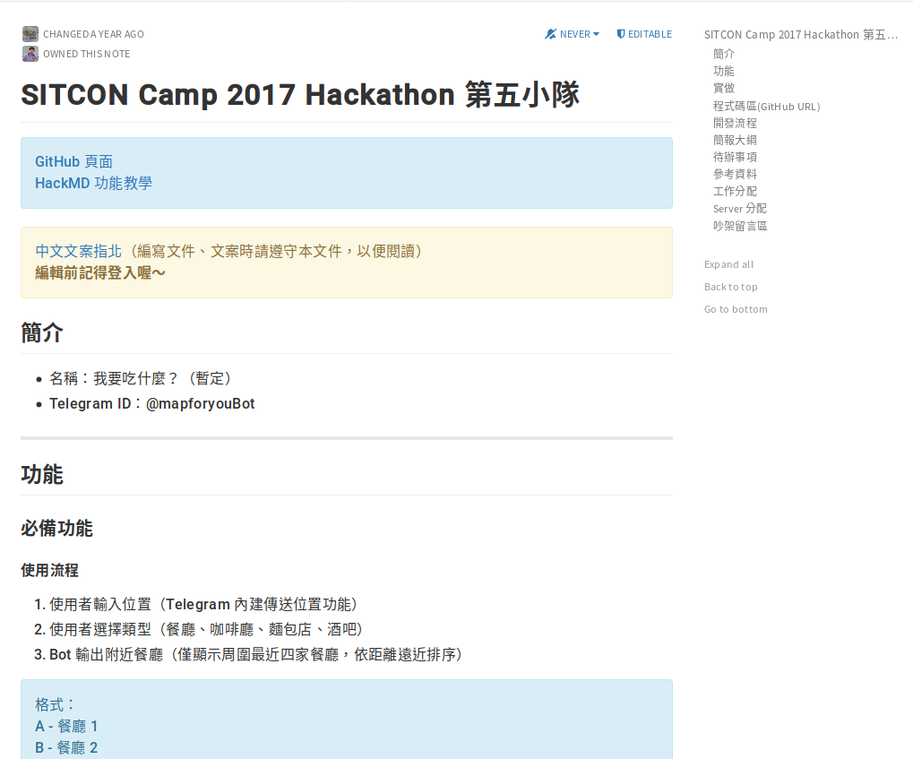

title: SITCON Camp 2017 所帶給我的感受與改變
output: index.html

--

<h1 style="font-size:200%">
    SITCON Camp 2017  
    所帶給我的感受與改變
</h1> 

<h4 style="font-size:90%"> 
    我如何從競賽圈探索到應用圈，以及那另我感動的黑客松
</h4> 

## 竹科實中 蘇柏瑄

<!--
<h4 style="text-align: center">
    https://brian.su/sitcon-camp-2018-slide
</h4>-->

--

### Me

  

## 竹科實中 高三 蘇柏瑄 (Brian Su)
#### https://brian.su

--

### 國小 - 機器人競賽

  

--

### 國中 - 科展

  

--

### 高一 - 競技程式

  

-- 

### 高一暑假 - SITCON Camp

  

(來源： <a href="https://www.facebook.com/SITCONtw/photos/a.331352053630247/1416768241755284/?type=3&theater">SITCON粉專</a>)

--

### 參加 SITCON Camp 後的改變

沒參加過 SITCON Camp  
- 改變為 -   
有參加過 SITCON Camp 

--

# The End

--

# 顯然不只阿XD

--

# 改變?

--

### 改變 - SSH

  
  

(左圖來源： <a>https://tr1.cbsistatic.com/hub/i/2009/08/06/ebdef8c2-c3b4-11e2-bc00-02911874f8c8/329326.jpg</a>)

--

### 改變 - 網路 (前)

  

(來源： <a>https://www.digitalcitizen.life/sites/default/files/gdrive/p2p/p2p__1.png</a>)

--

### 改變 - 網路 (後)

  

(來源： <a>https://i.stack.imgur.com/AlLyr.jpg</a>)

--

### 改變 - 寫網站 (前)

  

(來源： <a>http://nebula.wsimg.com/5811aef04e80a0cf156d92f0f3485f23?AccessKeyId=3B2C2409289B5B311341&disposition=0&alloworigin=1</a>)

--

### 改變 - 寫網站 (後)

  

(來源： <a>https://fiverr-res.cloudinary.com/images/t_main1,q_auto,f_auto/gigs/99178782/original/24b79181371fc099fb8eaa7fe5c030f2c1cb23fb/write-php-mysql-html-css-js-bootstrap-codes-for-you.png</a>)

--

# 真的只有這些嗎?

--

# ✘技能

--

# ✔眼界

--

### 眼界

- 摸索 Unix 系統 (學校server,筆電)
- 管理自己的server
- 學習寫網頁
- 參加Conf
- AIS3
- ...

--

# 感動?

--

#  黑客松

-- 

### bot - 「我要吃什麼?」 (1)

  

-- 

### bot - 「我要吃什麼?」 (2)

  

-- 

### bot - 「我要吃什麼?」 (3)

  

-- 

### bot - 「我要吃什麼?」 (4)

  

-- 

### bot - 「我要吃什麼?」 (5)

  

--

# 為何感動?

--

### 分工

- 後端 - telegram & google api
- 後端 - 天氣 api & 圖片
- 前端 - 界面設計
- 專案說明文件
- 投影片

--

###  ~~gIthUb~~ GitHub

  

--

### 開發文件

  

--

### 簡報

  

--

### 再看一次前端

  

--

# 感謝

--

# The End